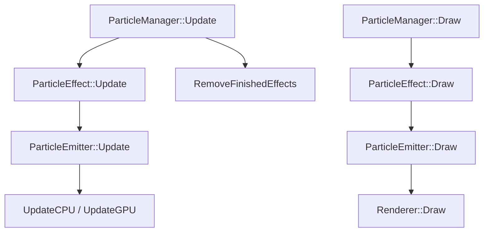

# Particle Lifecycle Regression Specification

この仕様書は、パーティクルエミッターおよびエフェクトのライフサイクル処理について、Pure GPU 化へ移行するにあたって維持すべき振る舞い（期待セマンティクス）と、現在 `GetParticles()` を用いて粒子数を直接参照している箇所の移行方針、およびコールグラフ関係を定義する。

---

## 1. コールグラフ & ライフサイクル状態遷移関係

### 1.1 コールグラフ (Call Graph)

パーティクル更新および描画の基本パスは以下の通り。



### 1.2 Play / Stop / Pause / Resume / Reset / Restart の呼出元
- **`Play()`**:
  - `ParticleEffect::Play()` -> `ParticleEmitter::Play()`
  - エディタ UI (`ParticleEditor.cpp` での再生ボタン押下時)
  - ベンチマーク開始時 (`ParticleTestScene.cpp:StartBenchmark`)
- **`Stop()`**:
  - `ParticleEffect::Stop()` -> `ParticleEmitter::Stop()`
  - エディタ UI (`ParticleEditor.cpp` での停止ボタン押下時)
  - ベンチマーク終了時 (`ParticleTestScene.cpp:StopBenchmark`)
- **`Pause() / Resume()`**:
  - エディタ UI の一時停止トグル
- **`Reset()`**:
  - エディタ UI のリセットボタン押下時
- **`Restart()`**:
  - `ParticleEffect::Restart()` は各エミッターの `Restart()` を呼び、Effectを再生状態にする。
  - `ParticleEmitter::Restart()` は既存粒子とレンダラー状態を保持し、エミッター年齢、ループ回数、delay、pause、および各モジュールの内部状態をリセットして生成を再開する。`Reset()` と同義ではない。

### 1.3 `GetParticles().empty() / size()` の全 Call Site 一覧

| 呼出元ファイルとシンボル | コード | 用途 | 移行先案 |
|---|---|---|---|
| `ParticleEffect.cpp` | `if (!emitter->GetParticles().empty())` | 粒子残存チェック | `emitter->HasAliveParticles()` (GPUカウンタからの非同期判定) |
| `ParticleEffect.cpp` | `if (emitter->IsEmitting() || !emitter->GetParticles().empty())` | プレイ継続判定 | `emitter->IsEmitting() || emitter->HasAliveParticles()` |
| `ParticleEffect.cpp` | `if (!emitter->GetParticles().empty())` | エフェクト完了判定 | `emitter->HasAliveParticles()` (GPUフェンスまたはcompletion record経由) |
| `ParticleTestScene.cpp` | `activeCount += ...GetParticles().size();` | 統計カウンター加算 | `GetActiveCount(CountType::LastKnown)` |
| `ParticleEditor.cpp` | `const auto& particles = emitter->GetParticles();` | エディタ用デバッグマーク描画 | `RequestParticleSnapshot()` (開発用非同期API) |
| `ParticleEditor.cpp` | `emitter->GetParticles().size()` | エディタ用統計表示 | `GetActiveCount(CountType::LastKnown)` |

### 1.4 状態フラグの関係性

- **`IsPlaying()`**: エミッターの再生状態トグル。`Play()` で `true`、`Stop()` で `false`。
- **`IsEmitting()`**: 新規粒子を「現在スポン中」であるかを示す。再生中であっても delay 中や duration 終了後は `false` になる。
- **`IsComplete()`**: 「`IsEmitting()` が `false` かつ、生存粒子数が `0`」である完了状態。

**関係式**:
```text
IsComplete() = !IsEmitting() && (ActiveParticles == 0)
```

- **Auto Remove 判定**:
  - `ParticleManager::RemoveFinishedEffects()` 内において、エフェクトの `autoRemove_` が `true` かつ `IsFinished()` (所属する全エミッターが `IsComplete()` である) の場合、マネージャから自動削除・破棄される。
- **Scene / Editor が Effect を削除する経路**:
  - シーン削除時: `ParticleManager::RemoveEffect(effect)` を経由した個別破棄。
  - エディタ新規作成・ロード時: `ParticleManager::RemoveEffect(currentEffect_)` を呼び出し個別破棄。

---

## 2. ライフサイクル 27 必須テストケース

### 1) Play直後の状態
- **Given**: エミッターが `Play()` された直後。
- **When**: 1フレーム目の `Update()` が呼ばれる。
- **Observed current behavior**: `IsPlaying() = true`, `IsEmitting() = true` となり、1フレーム目から Spawner に基づき粒子がスポンされる。
- **Expected behavior to preserve**: 同等。
- **Allowed Pure GPU difference**: なし。

### 2) Pause / Resume
- **Given**: 粒子が空中を飛散している再生中の状態。
- **When**: `Pause()` を呼び出し、数フレーム後に `Resume()` を呼ぶ。
- **Observed current behavior**: `Pause()` 中は粒子更新がスキップされ、`deltaTime = 0` 扱い。`Resume()` で元の速度・寿命減衰が再開する。
- **Expected behavior to preserve**: 同等。
- **Allowed Pure GPU difference**: GPU 側定数バッファの `deltaTime` に `0` を設定するか、CS Dispatch をスキップして表現。
- **DECISION_REQUIRED**: なし。

### 3) Stop + Complete
- **Given**: 粒子が再生・放出中の状態。
- **When**: `Stop()` を呼ぶ（エミッター設定：`Complete`）。
- **Observed current behavior**: `IsEmitting()` は即座に `false` になり新規スポンは止まるが、既存粒子は寿命が尽きるまで生存し、更新・描画され続ける。
- **Expected behavior to preserve**: 同等。
- **Allowed Pure GPU difference**: なし。

### 4) Stop + Kill
- **Given**: 粒子が再生・放出中の状態。
- **When**: `Stop()` を呼ぶ（エミッター設定：`Kill`）。
- **Observed current behavior**: `IsEmitting()` は即座に `false` になり、かつ既存の `particles_` ベクタが即時 `clear()` され、画面から全粒子が消滅する。
- **Expected behavior to preserve**: 同等。
- **Allowed Pure GPU difference**: GPU側のカウンターおよび生存数をコマンド経由で即時 `0` にリセットする。
- **DECISION_REQUIRED**: GPUシミュレーション時に、CS Dispatchを介して即時0クリアが同一フレーム内に適用されるか、コマンドバッファ実行を考慮した1フレーム遅延を許容するか。

### 5) Reset
- **Given**: 粒子が放出中。
- **When**: `Reset()` を呼ぶ。
- **Observed current behavior**: 既存粒子はすべて消滅し、エミッター経過時間 `emitterAge_` 等が `0` にリセットされ、再生状態自体は維持される。
- **Expected behavior to preserve**: 同等。
- **Allowed Pure GPU difference**: GPUバッファ・カウンタを即時リセット。

### 6) Restart
- **Given**: 粒子が放出中または完了後。
- **When**: `Restart()` を呼ぶ。
- **Observed current behavior**: **既存の粒子は保持されたまま**、エミッターのライフサイクル（経過時間、ループカウント等）およびモジュール内部の生成状態（累積タイマー等）が初期位置に戻り、新規の生成が再開される。レンダラーの描画キャッシュ等はリセットされない。
- **Expected behavior to preserve**: 同等（「Reset後にPlay」する動きではなく、既存粒子を保持する挙動を維持する）。
- **Allowed Pure GPU difference**: なし。

### 7) duration 0 / 正値
- **Given**: `duration` が `0` または正値に設定されている。
- **When**: 更新が進行する。
- **Observed current behavior**: `duration` が正値の場合は `duration` 経過後に `IsEmitting()` が `false` になる。`duration = 0` の場合の挙動は登録されているモジュールによって変化する（ケース8を参照）。
- **Expected behavior to preserve**: 同等。
- **Allowed Pure GPU difference**: なし。

### 8) Once / Infinite / Multiple ループモードと duration=0 のモジュール別挙動
- **Given**: 各ループモードおよび `duration = 0` が設定されている。
- **When**: 更新進行。
- **Observed current behavior**:
  - `SpawnRate` が登録されている場合：`duration = 0 + Once` であっても、エミッターは自発的に放出停止（完了）せず、無限にスポンを継続する。
  - 有限の `SpawnBurst` のみが登録されている場合：指定されたループ数に達すると自動的に `IsComplete() = true` となり、放出を停止する。
  - 複数の Spawn モジュールが存在する場合：すべてのモジュールが完了した時点で初めてエミッターが生成停止する。
  - Spawn モジュールが存在しない場合：`IsEmitting()` は最初から `false` のままであり、既存粒子が寿命を迎え消滅した時点で完了する。
- **Expected behavior to preserve**: 同等。
- **Allowed Pure GPU difference**: なし。

### 9) loop count 境界
- **Given**: `loopCount = 3` に設定。
- **When**: 3回目の `duration` 経過に達する。
- **Observed current behavior**: 正確に 3周完了した瞬間に `IsEmitting()` が `false` となり、新規スポンが停止する。
- **Expected behavior to preserve**: 同等。
- **Allowed Pure GPU difference**: なし。

### 10) start delay 中の既存粒子更新
- **Given**: `Restart()` 時など、`startDelay` のカウント中に既存の古い残存粒子が空中に残っている状態。
- **When**: 更新が走る。
- **Observed current behavior**: 新規スポンは delay により停止しているが、すでに画面上にある残存粒子は正常に時間減衰・移動が進行する。
- **Expected behavior to preserve**: 同等。
- **Allowed Pure GPU difference**: なし。

### 11) SpawnRate accumulator
- **Given**: `SpawnRate` モジュールがアキュムレータによって動作している。
- **When**: 毎フレームの `deltaTime` が蓄積される。
- **Observed current behavior**: スポンの時間蓄積は `spawnAccumulator_` ではなく **`timeSinceLastSpawn_`** シンボルに蓄積され、フレームを跨いで正確に放出タイミングが制御される。
- **Expected behavior to preserve**: 同等の蓄積挙動。
- **Pure GPU implementation**: アキュムレータは GPU 側の `EmitterStateBuffer` 上に実装され、`ParticleSpawnPrepare.CS.hlsl` が生成数、Burst interval/loop、spawn serialを更新する。CPU particle vectorは生成数制御に使用しない。
- **DECISION_REQUIRED**: 同一の fixed timestep / seed において、生成数が理論上完全に維持されること。

### 12) 単発 SpawnBurst
- **Given**: `loops = 1`, `delay = 0` の `SpawnBurst` が登録されている。
- **When**: エミッター再生開始。
- **Observed current behavior**: 開始直後の 1 フレーム目に指定数（例: 100粒子）が一括でスポンされる。
- **Expected behavior to preserve**: 同等。
- **Allowed Pure GPU difference**: なし。

### 13) interval / loops 付き SpawnBurst
- **Given**: `interval = 1.0f`, `loops = 5` の `SpawnBurst` が登録されている.
- **When**: 更新進行。
- **Observed current behavior**: 開始時および 1 秒ごとに計 5 回バースト生成が発生する。
- **Expected behavior to preserve**: 同等。
- **Allowed Pure GPU difference**: なし。

### 14) 最後の粒子死亡と Effect 完了
- **Given**: `IsEmitting() = false` になり、残存粒子が 1 個だけ残っている。
- **When**: その 1 個の粒子が死亡する。
- **Observed current behavior**: そのフレームの `Update()` 直後に `IsComplete()` が `true` になり、即座に破棄キューに入る。
- **Expected behavior to preserve**: 完了通知が速やかに行われること。
- **Allowed Pure GPU difference**: GPUシミュレーション時は、非同期の Readback またはフェンス同期による死亡検知が行われるため、CPU側で `IsComplete() = true` と検知するまでに 1〜2 フレームの遅延が発生する。
- **DECISION_REQUIRED**: Gameplayロジック側が数フレームの完了遅延を許容すること。

### 15) ClearParticles
- **Given**: 粒子が放出中。
- **When**: `ClearParticles()` が呼ばれる。
- **Observed current behavior**: `particles_` ベクタがクリアされ、全粒子が即座に消滅する。
- **Expected behavior to preserve**: 同等。
- **Allowed Pure GPU difference**: GPU側のカウンターおよびバッファのリセット。

### 16) CPU / GPU simulation mode 切替時の既存粒子クリア
- **Given**: 再生中に `SetSimulationMode()` を呼ぶ。
- **When**: モードが切り替わる。
- **Observed current behavior**: CPU/GPU 間で切り替えが発生した際、`SetSimulationMode()` はCPU particle vectorとGPU simulatorのpool状態を即時クリアする。既存粒子を維持したままシームレスに移送する仕様ではない。
- **Expected behavior to preserve**: 同等（現行互換として全粒子を一旦消去する）。
- **Allowed Pure GPU difference**: なし。
- **DECISION_REQUIRED**: 将来的に、切替時にCPU<->GPU間で粒子データを同期的にアップロード/リードバックして位置などを維持する移送処理をサポートするかどうか。

### 17) max particles 変更
- **Given**: 再生中に `SetMaxParticles()` を呼ぶ。
- **When**: 最大粒子数が変更される。
- **Observed current behavior**: ベクタの最大容量や制限上限が変わる。
- **Expected behavior to preserve**: 制限制限の変更。
- **Allowed Pure GPU difference**: GPU側の構造化バッファの再アロケーションが発生する。
- **DECISION_REQUIRED**: 動的再アロケーション時の同期コストおよび一時的なバッファ喪失許容性。

### 18) Local / World follow 挙動
- **Given**: エミッターに `followTarget_` が指定され、SimulationSpace が World / Local に設定されている。
- **When**: エミッターが移動する。
- **Observed current behavior**: (実装上、座標変換処理で emitter 位置が反映される)。
- **Expected behavior to preserve**: World スペース時は放出された粒子は移動せずその場に残り、Local スペース時はエミッターの移動に全粒子が追従すること。
- **DECISION_REQUIRED**: 実行時のビジュアルおよび親子トランスフォームの挙動に矛盾がないこと。

### 19) follow emitter
- **Given**: 粒子が放出されている。
- **When**: エミッターの位置 `position_` を直接書き換える。
- **Observed current behavior**: スポンスペース（Local/World）に応じて、粒子が追従または残留する。
- **Expected behavior to preserve**: 同等。
- **Allowed Pure GPU difference**: なし。

### 20) Local / World simulation
- **Given**: シミュレーションスペースを設定。
- **When**: エミッターが移動。
- **Observed current behavior**: Localでは相対座標、Worldでは絶対座標で粒子が更新・描画される。
- **Expected behavior to preserve**: 同等。
- **Allowed Pure GPU difference**: GPU定数バッファのトランスフォーム行列適用タイミングで処理。

### 21) deltaTime 0
- **Given**: ゲーム全体のポーズなどにより `deltaTime = 0` が渡される.
- **When**: 更新が呼ばれる。
- **Observed current behavior**: 粒子の寿命や移動が一切進行せず、フリーズ状態になる。
- **Expected behavior to preserve**: 同等。
- **Allowed Pure GPU difference**: なし。

### 22) 通常 deltaTime
- **Given**: 標準的な `16.6ms` などのフレーム時間。
- **When**: 更新進行。
- **Observed current behavior**: スムーズに更新される。
- **Expected behavior to preserve**: 同等。
- **Allowed Pure GPU difference**: なし。

### 23) 大きな deltaTime spike
- **Given**: スパイク（例: `500ms` のフリーズ）が発生。
- **When**: 更新進行。
- **Observed current behavior**: 粒子が一挙にワープ移動するか、または寿命を大量に消費して一括消滅する。
- **Expected behavior to preserve**: 現行の更新処理に基づきそのままシミュレートされること。
- **DECISION_REQUIRED**: spike発生時に、フレーム更新を一定上限値（例: 0.1s）でクランプする安全保護機能を導入すべきか。

### 24) time scale 0
- **Given**: `timeScale = 0` によるスローモーション制限。
- **When**: 更新進行。
- **Observed current behavior**: `deltaTime = 0` と同等に停止。
- **Expected behavior to preserve**: 同等。
- **Allowed Pure GPU difference**: なし.

### 25) Effect 削除時の即時 GPU resource 解放
- **Given**: エフェクトが再生中。
- **When**: `ParticleManager::RemoveEffect()` で削除される。
- **Observed current behavior**: unique_ptr の寿命が尽き、C++ オブジェクトが即時に破棄される。
- **Expected behavior to preserve**: メモリリークなくリソースが安全に解放されること。
- **Allowed Pure GPU difference**: GPU 側バッファについては、GPU が現在実行中のコマンドを壊さないよう、マネージャの `rendererTrashBin_` のような仕組みを利用して、GPU 使用終了後に安全に遅延解放（deferred release）される必要がある。
- **DECISION_REQUIRED**: GPU側のフェンス待機を同期的に入れるか、遅延破棄キューで非同期解放するか。

### 26) Renderer 差し替え
- **Given**: 再生中に `SetRenderer()` で異なるレンダラーへ差し替え。
- **When**: 描画実行。
- **Observed current behavior**: 旧レンダラーが破棄キュー（TrashBin）に送られ、新レンダラーが作成される。
- **Expected behavior to preserve**: 同等。
- **Allowed Pure GPU difference**: なし。

### 27) scene 終了時の同期処理
- **Given**: シーン遷移時またはアプリケーション終了時。
- **When**: パーティクルマネージャの `Finalize` または `Clear` が呼ばれる。
- **Observed current behavior**: メモリが解放される。
- **Expected behavior to preserve**: dangling pointer やメモリリーク、GPU 側のクラッシュを発生させずに破棄されること。
- **Allowed Pure GPU difference**: GPU コマンドがすべて実行完了するまで CPU 側で同期フェンス待機（`CommandQueue::Signal` / `Wait`）を走らせる必要がある。
- **DECISION_REQUIRED**: 破棄時の同期待機の実装方針。

---

## 3. DECISION_REQUIRED & 検討事項

### 3.1 Completion Record と Particle Snapshot Readback の分離
- **定義**:
  - **Completion Record**: GPU 側での「全粒子消滅フラグ」または「アクティブ数カウンタ」のみを non-blocking に取得する超軽量な仕組み（1値読み出し）。
  - **Particle Snapshot Readback**: デバッグやエディタ用に、GPU上の全粒子の詳細データ（座標、色、寿命など）をメモリコピーして CPU に読み出す高コストな仕組み。
- **決定事項**: リリースビルドでは Snapshot Readback は完全に無効化する。エフェクト完了検知には Completion Record による 1〜2 フレーム遅延の非同期チェックを許容する。

### 3.2 既存テストフレームワーク非存在に伴うマニュアルテスト仕様

本リポジトリには自動テストフレームワークが同梱されておらず、新規の外部依存（GoogleTest等）の追加も禁止されているため、以下のマニュアルテストケースと期待結果をテスト実行ガイドとして定義する。

#### マニュアルテストケース一覧
1. **Start/Stop 100回連続実行テスト**
   - **手順**: ベンチマーク ImGui UI から、B01プリセットなどを「Start Benchmark」->「Stop Benchmark」を 100 回連続ですばやく繰り返す。
   - **期待結果**: クラッシュや dangling pointer による例外が発生せず、メモリ使用量が安定していること。
2. **ベンチマーク実行中のシーン終了テスト**
   - **手順**: ベンチマークを動かした状態のまま、F1 キー等で TitleScene などの別シーンへ遷移、またはアプリケーションを終了する。
   - **期待結果**: `OnFinalize` 時の破棄順序が正常であり、二重解放や use-after-free が発生しないこと。
3. **エディタ編集中のベンチマーク切り替えテスト**
   - **手順**: エディタで新規エフェクトを作成・編集し、粒子が出ている状態からベンチマークを開始し、再度停止してエディタに戻る。
   - **期待結果**: ベンチマーク開始時に編集中のエフェクトが安全に detach され、ベンチマーク停止後にクリーンな空エフェクトが再生成されること。
